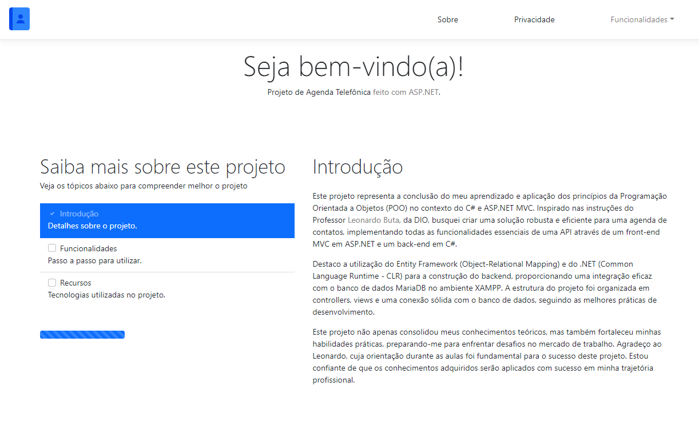

# AGENDA DE CONTATOS
Este projeto representa a conclusão do meu aprendizado e aplicação dos princípios da Programação Orientada a Objetos (POO) no contexto do C# e ASP.NET MVC. Inspirado nas instruções do Professor Leonardo Buta, da DIO, busquei criar uma solução robusta e eficiente para uma agenda de contatos, implementando todas as funcionalidades essenciais de uma API através de um front-end MVC em ASP.NET e um back-end em C#.

## Recursos utilizados
<li>C# / .NET / ASP.NET MVC (8.0.101</li>
<li>Entity Framework (8.0.2)</li>
<li>Pomelo MySQL (8.0.0)</li>
<li>Xampp (8.2.12)</li>
<li>Bootstrap (5.3.3)</li>

## Observações
Para testar o projeto localmente, é necessário configurar um servidor local. Recomenda-se o uso do Xampp para essa finalidade. Após instalar o Xampp, você precisará ajustar as configurações de conexão no arquivo "aspsettings.Development.json".
<ol>
  <li>Instale o Xampp: Se ainda não o fez, baixe e instale o Xampp no seu sistema operacional;</li>
  <li>Localize o arquivo "aspsettings.Development.json": Este arquivo é geralmente encontrado dentro do diretório do projeto em que você está trabalhando. Ele contém as configurações de conexão com o banco de dados;</li>
  <li>Altere a ConnectionString: Abra o arquivo "aspsettings.Development.json" e encontre a seção onde a ConnectionString está definida. Certifique-se de alterar o valor de "Server" para "localhost" e, se a porta padrão do MySQL no Xampp foi alterada (geralmente é 3306), ajuste a porta conforme necessário;</li>
  <li>Verifique o usuário e a senha: Garanta que o usuário e a senha configurados no Xampp correspondam aos definidos na ConnectionString;</li>
  <li>Aplique as migrações do Entity Framework: Abra um terminal na pasta do projeto e execute o seguinte comando para aplicar as migrações ao banco de dados: dotnet ef database update;</li>
  <li>Salve as alterações e execute o projeto: Após fazer essas alterações, salve o arquivo "aspsettings.Development.json". Em seguida, execute o seguinte comando para iniciar o projeto: dotnet watch run;</li>
  <li>Certifique-se de que o servidor MySQL no Xampp esteja em execução enquanto você testa o projeto localmente. Essas etapas devem permitir que o projeto se conecte ao banco de dados MySQL do Xampp sem problemas.</li>
</ol>
